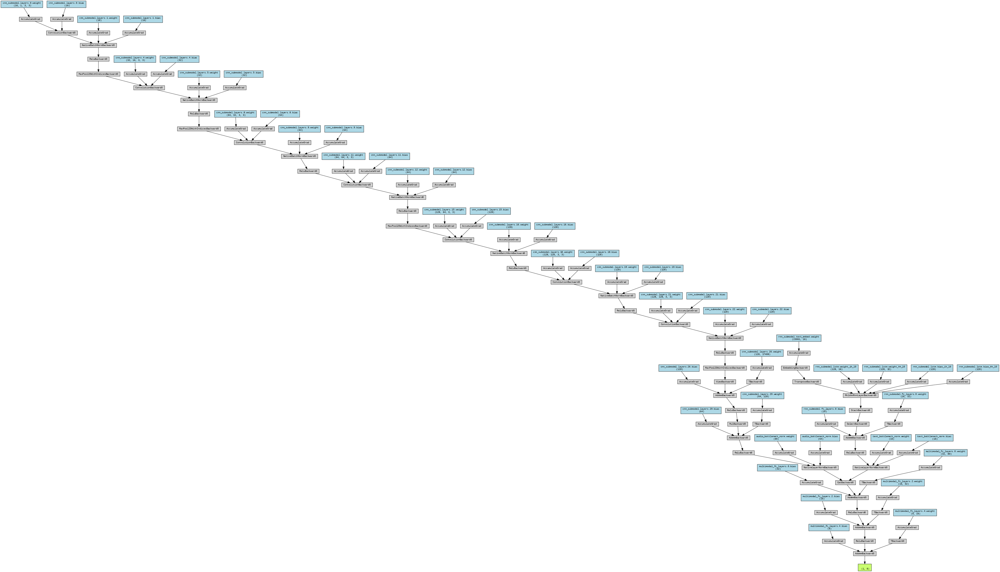
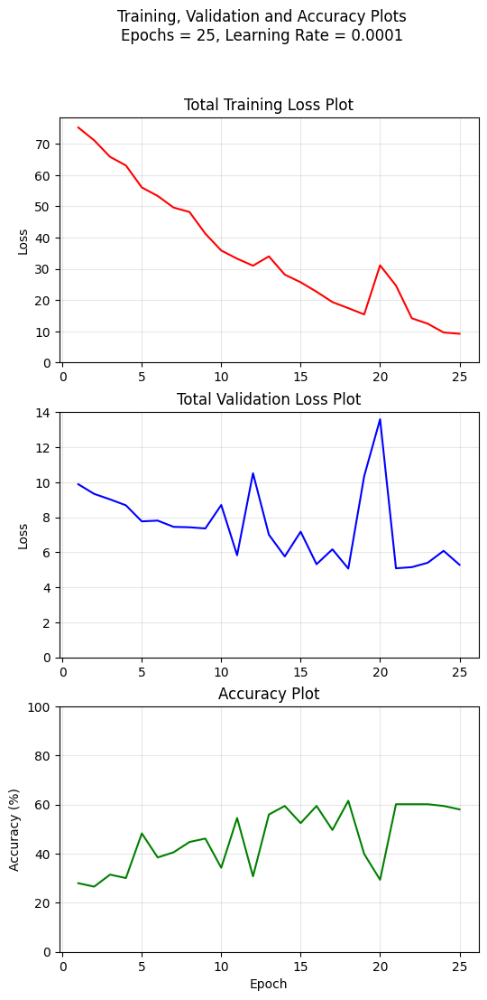
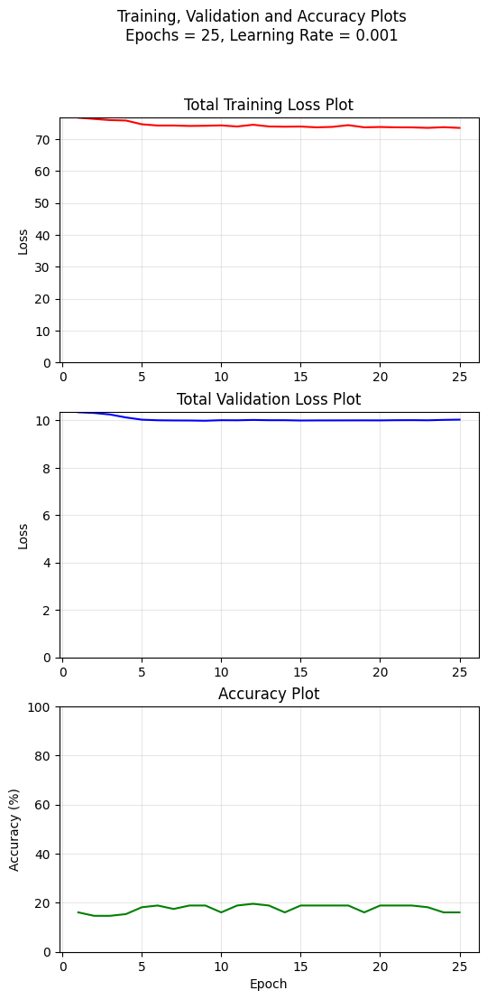
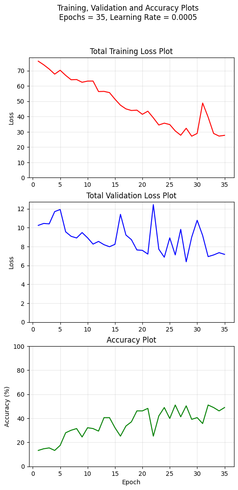

## Architecture Diagram:

## Learning Abilities of the Different Models:
The CNN model has the ability to learn the emotion categories from the spectrograms to a decent extent. However, the RNN cannot use the text alone to properly distinguish among various emotions. The reason is that in this particular dataset, the same sentences have been used for all the emotions. Hence, the accuracy of the RNN is quite low, due to the nature of the text data. Early Fusion has been implemented in this multimodal implementation, since in a more generalized setting and more generalized dataset, the Early Fusion approach would allow the CNN and RNN to learn from the gradient information of each other and hence compliment each others' information retrieval and propagation. Due to the poor predictive capability of the RNN, the MultiModal architecture delivers a worse performance than the CNN, but a better one than the RNN.
## Architecture Decisions
The CNN has 7 convolutional, batch normalization and ReLU layers, with 4 MaxPooling layers to reduce the dimensions. The dimensions of the input spectrogram have been brought down as quickly as possible, followed by deeper layers of smaller feature dimensions in order to optimize the learning of crucial feature maps. The fully connected layer has three linear layers with a dropout of 0.3 in order to improve the model's generalization ability.

The RNN has 16 embedding dimensions, since the length of the tokenized text itself is not very large. Similarly, there are 32 hidden features used. These numbers have been kept small so as to avoid overfitting the data.

In the MultiModal architecture, 3 linear layers have been used in the fully connected layer.

The various architectural decisions such as the number of convolutional layers and their dimensions in the CNN, the number of hidden features in the RNN, etc. have been made based on experimentation as instructed in the task description.

## Results Table
| Model | Accuracy |
| :--- | :--- |
| CNN | 59.03 % |
| RNN | 17.36 % |
| MultiModal | 46.53 % |

## Training and Validation Loss Plots
## Plots for the CNN

## Plots for the RNN

## Plots for the MultiModal Architecture

